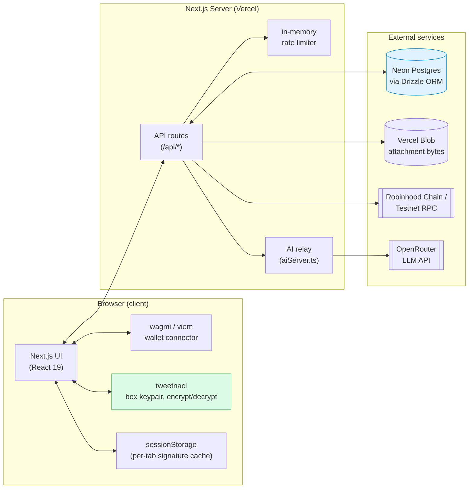
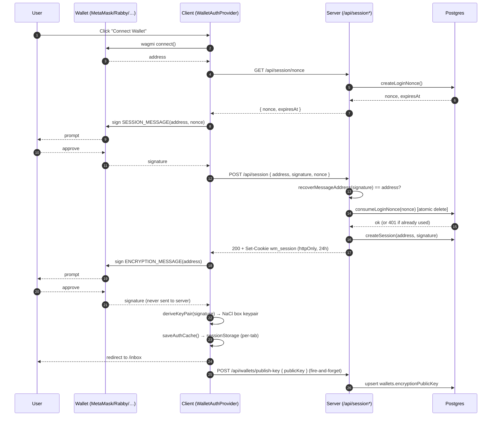
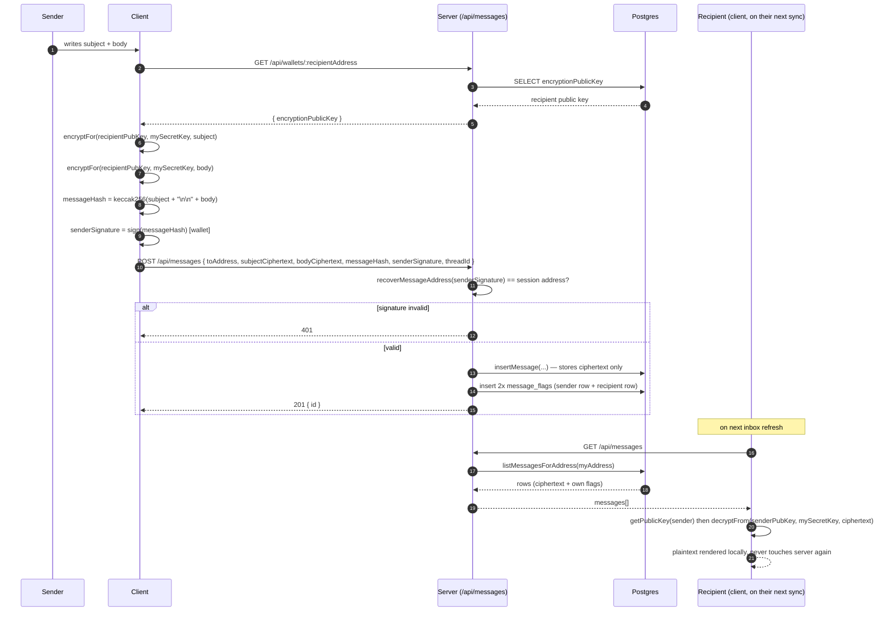
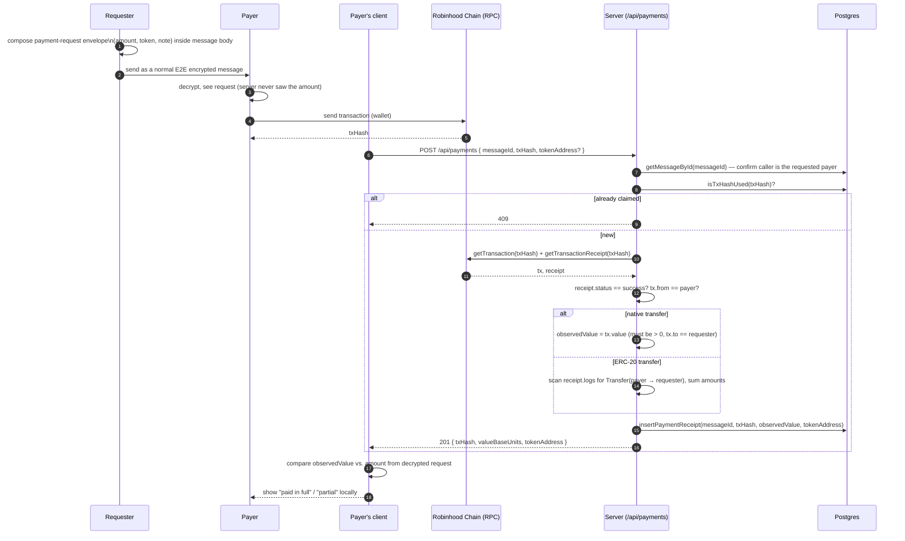
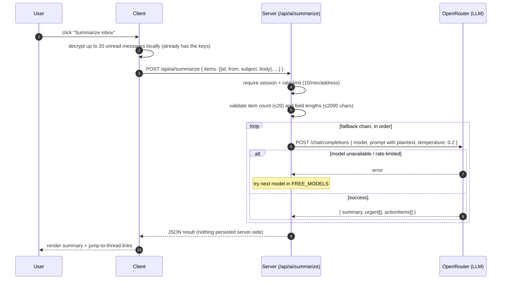
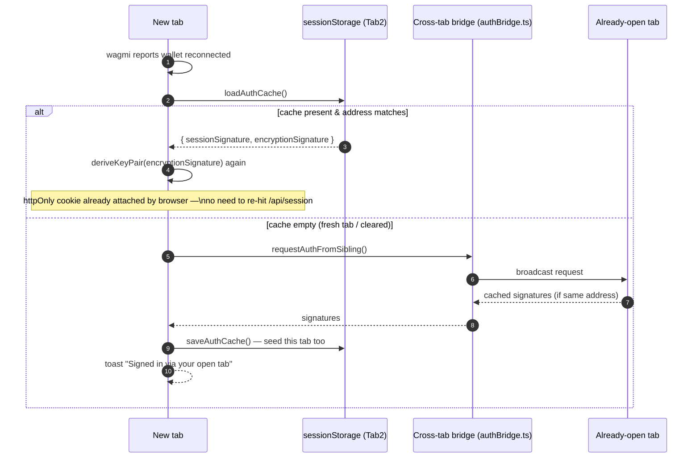

# Quill

Wallet-native, end-to-end encrypted email. No accounts, no passwords — you sign in with an EVM wallet, every message is cryptographically signed and encrypted in the browser before it ever leaves, and the server only ever stores ciphertext.

Built with Next.js 16 (App Router), wagmi/viem, Drizzle ORM on Neon Postgres, and NaCl (`tweetnacl`) for encryption.

---

## Table of contents

- [Architecture overview](#architecture-overview)
- [Tech stack](#tech-stack)
- [Security model](#security-model)
- [Sequence diagrams](#sequence-diagrams)
  - [1. Wallet sign-in (two-signature auth)](#1-wallet-sign-in-two-signature-auth)
  - [2. Composing & sending an encrypted message](#2-composing--sending-an-encrypted-message)
  - [3. On-chain payment request & settlement](#3-on-chain-payment-request--settlement)
  - [4. AI inbox summary (BYOK-adjacent, server-relayed)](#4-ai-inbox-summary-byok-adjacent-server-relayed)
  - [5. Session restore across tabs/reload](#5-session-restore-across-tabsreload)
- [Database schema](#database-schema)
- [API surface](#api-surface)
- [Local development](#local-development)
- [Environment variables](#environment-variables)

---

## Architecture overview



Key architectural decision: **the server is a dumb relay for ciphertext.** Subjects and bodies are encrypted client-side with a key derived from a wallet signature; Postgres only ever stores base64 blobs it cannot open. The one deliberate exception is [AI inbox summary](#4-ai-inbox-summary-byok-adjacent-server-relayed), where already-decrypted text is forwarded to an LLM provider and never persisted.

## Tech stack

| Layer | Choice |
|---|---|
| Framework | Next.js 16 (App Router), React 19 |
| Wallet / chain | wagmi 3, viem 2 — [Robinhood Chain](https://chain.robinhood.com) (id `4663`) + Testnet (id `46630`) |
| Encryption | `tweetnacl` NaCl `box` (curve25519-xsalsa20-poly1305) — same primitive as MetaMask's legacy `eth_getEncryptionPublicKey`/`encrypt` |
| Hashing / signing | `viem` `keccak256` + `personal_sign` |
| Database | Neon Postgres via `@neondatabase/serverless`, Drizzle ORM (`drizzle-kit generate` / `migrate` / `studio`) |
| File storage | Vercel Blob (attachment bytes; metadata + wrapped keys in Postgres) |
| AI | OpenRouter, free-tier models with in-order fallback |
| Styling | Tailwind CSS v4 |
| Deploy | Vercel |

## Security model

- **No passwords, no accounts.** Identity = wallet address. Session = a signature over a server-issued one-time nonce.
- **Two signatures, two purposes, never conflated:**
  1. **Session signature** → verified server-side, opens a 24h httpOnly-cookie session. Replay-protected by a one-time nonce (`loginNonces` table, atomically consumed only *after* the signature checks out).
  2. **Encryption signature** → *never sent to the server*. It's the seed for a deterministic NaCl keypair derived entirely client-side. Only the resulting **public** key is published (`POST /api/wallets/publish-key`).
- **Per-viewer state, not shared state.** A `messages` row holds no read/starred/archived/deleted flags — those live in a separate `message_flags` row keyed by `(messageId, address)`, one per side of the conversation. Archiving your copy of a thread doesn't touch the other person's inbox.
- **Signed, not just encrypted.** Every message's sender signs `keccak256(subject + body)` with their wallet key *before* encrypting. The server verifies this recovers to the authenticated session address, so a public "proof" page can later show *who sent this* without ever decrypting the content.
- **Payments are independently re-verified on-chain**, not trusted from the client. The server takes a `txHash`, queries the RPC directly, and only accepts it if the receipt succeeded, the sender matches, and the transferred value (native or ERC-20 `Transfer` log) is non-zero. The *expected* amount lives inside the encrypted message body and is never known to the server.
- **Rate limiting** on every mutating/expensive route (`send`, `session`, `nonce`, `ai-summarize`, `pay`) — in-memory, per-process (documented limitation: not distributed across multiple server instances).

## Sequence diagrams

### 1. Wallet sign-in (two-signature auth)



### 2. Composing & sending an encrypted message



### 3. On-chain payment request & settlement



### 4. AI inbox summary (BYOK-adjacent, server-relayed)

The one deliberate exception to "server never sees plaintext" — flagged explicitly in the UI. Nothing here is ever written to Postgres.



### 5. Session restore across tabs/reload



## Database schema

All tables live in `src/lib/db/schema.ts`, migrated with Drizzle (`drizzle/0000...0011*.sql`).

| Table | Purpose | Notable design |
|---|---|---|
| `wallets` | address → published encryption public key | Address is the identity; no username/registry table (deliberately — avoids an enumerable address directory) |
| `messages` | ciphertext + signature per message | Holds **no** per-viewer state; shared between sender & recipient |
| `message_flags` | read/starred/archived/deleted | One row per `(messageId, address)` — the per-viewer-flag pattern that makes inbox actions private to each side |
| `payment_receipts` | verified on-chain settlements | Unique on `txHash` (no double-claiming) and `messageId` (one receipt per request) |
| `labels` / `message_labels` | private labels | Per-viewer, same pattern as flags |
| `attachments` | encrypted file metadata | Bytes in Vercel Blob; filename + a NaCl-wrapped file key stored alongside |
| `drafts` | self-encrypted drafts | Encrypted to the owner's own public key |
| `login_nonces` | one-time SIWE-style nonces | Atomically consumed — replay protection |
| `sessions` | active 24h sessions | Backs the `wm_session` httpOnly cookie |

## API surface

| Route | Method | Notes |
|---|---|---|
| `/api/session/nonce` | GET | Issues a one-time login nonce (rate-limited) |
| `/api/session` | POST / DELETE | Verify session signature + consume nonce → cookie / sign out |
| `/api/wallets/publish-key` | POST | Publish your NaCl public key |
| `/api/wallets/[address]` | GET | Look up someone's public key |
| `/api/messages` | GET / POST | List inbox / send a signed, encrypted message |
| `/api/messages/[id]` | PATCH / DELETE | Per-viewer flags (read/star/archive/delete), purge |
| `/api/drafts`, `/api/drafts/[id]` | GET/POST/PATCH/DELETE | Self-encrypted draft CRUD |
| `/api/payments` | POST | Submit a `txHash` for independent on-chain verification |
| `/api/verify/[id]` | GET | Public proof-of-authorship page data (no decryption) |
| `/api/ai/summarize` | POST | Server-relayed LLM summary (see diagram 4) |

## Local development

```bash
npm install
npm run dev      # http://localhost:3000
```

Database:

```bash
npm run db:generate   # generate a new migration from schema.ts changes
npm run db:migrate    # apply pending migrations
npm run db:studio     # Drizzle Studio GUI
```

> **Note:** local and production point at the same `DATABASE_URL` in this project's current setup (single Neon instance) — running `db:migrate` locally migrates production too. Double-check `DATABASE_URL` before running it if that ever changes.

## Environment variables

See `.env.example` for the full list with descriptions. Summary:

| Variable | Required | Purpose |
|---|---|---|
| `DATABASE_URL` | Yes | Neon Postgres connection string |
| `SYSTEM_WALLET_PRIVATE_KEY` | Optional | Sends onboarding mail as "Quill Team" through the same signed/encrypted path as a real user — skipped silently if unset |
| `OPENROUTER_API_KEY` | Optional | Enables AI inbox summaries; feature shows "not configured" if unset |
| `BLOB_READ_WRITE_TOKEN` | Optional | Vercel Blob token for attachment storage |
